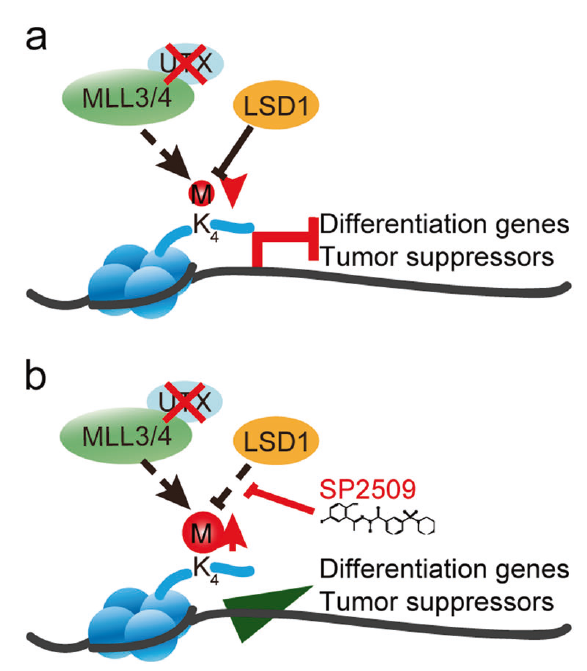

# LSD1_UTX_SCRIPTS

Epigenetic drug library screening identified an LSD1 inhibitor to target UTX-deficient cells for differentiation therapy

# Citation

Our paper has been published on [Signal Transduction and Targeted Therapy, STTT](https://www.nature.com/articles/s41392-019-0040-2) 

And you could download the .pdf file for reading by clicking [here](MS/)

The supplemental data and information could be accessible by clicking [here](2_pdf/)
